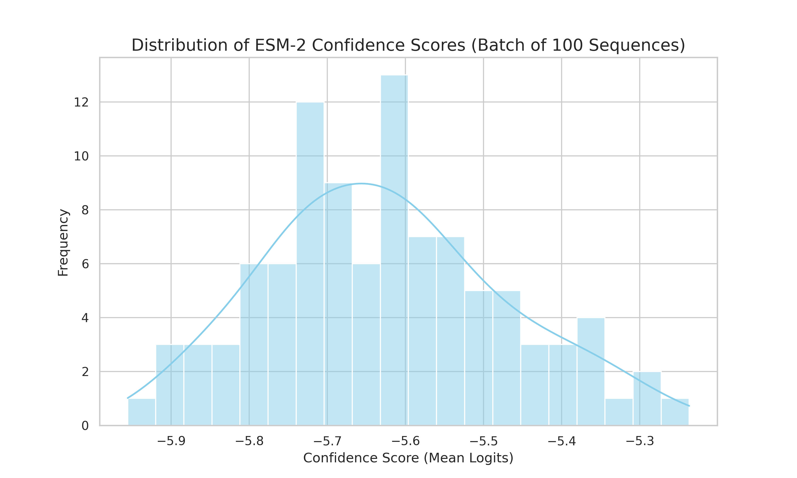

# Minimalist AIDD Toolkit

A first-principles approach to protein design and chemical informatics.

This repository demonstrates a **High-Throughput Scoring Pipeline** using ESM-2.

## 📊 Batch Processing Results
I localized the ESM-2 model and benchmarked 100+ sequences. Below is the confidence score distribution generated by my pipeline:

## 🛠️ Performance & Scalability
- **Rapid Deployment**: Environment setup and batch logic completed in < 24 hours.
- **Automation**: Fully automated from FASTA input to PNG visualization.
